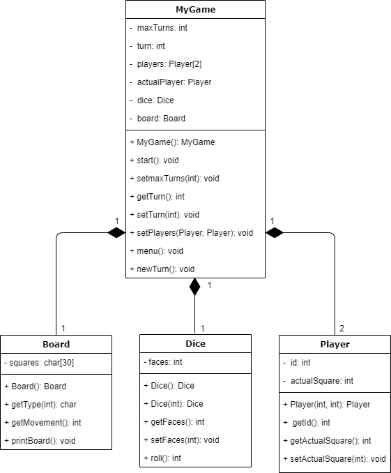

# Snakes & Ladders :snake:


## Instrucciones 
  1. Clonar el repositorio
  ```bash
  git clone https://github.com/louloubadillo/OOP_TC1030.git
  ```
  2. Moverse a la carpeta que contenga el ejercicio que se quiere compilar
  ```bash
  cd TC1030 - T1 - A01024232/src
  ```
  3. Compilar los archivos .cpp
  ```bash
  g++ *.cpp
  ```
  4. Correr el ejecutable
  ```bash
  ./a.out
  ```
## Diagrama UML
Este es el diagrama de clases del programa: <br><br>


## Explicación
El programa consiste de 4 clases: 
- Dice es una clase que representa un dado. Por default, éste tiene 6 caras, sin embargo, se puede crear una instancia con las caras que se requieran. El método roll genera un número entero aleatorio entre 1 y el total de caras. <br><br>
- Board es la clase que representa el tablero del juego. Las indicaciones eran que éste debía constar de 30 casillas, de las cuales 3 eran serpientes (S) y 3 eran escaleras (L), el resto se representaban con una N. <br>
Utilicé un arreglo de datos tipo char debido a que conocía el tamaño fijo que debía tener mi estructura. Por medio de un for inicialicé todas las casillas para que fueran de tipo N y, posteriormente, escogí las casillas especiales.<br>
Los métodos que implementé fueron: 
  - int getMovement(int i), el cual a partir del tipo de casilla en un índice i, regregresa el movimiento adicional que el jugador debe realizar.
  - char getType(int i), que regresa el char de la casilla especificada por el índice.
  - void printBoard(), el cual imprime el tablero. Este lo hice con el fin de poder visualizar lo que estaba pasando y realizar pruebas a lo largo del desarrollo del entregable. 
<br><br>
- Player es una clase que representa a un jugador. De acuerdo a las indicaciones, lo único que nos importa de éste es su número y la casilla en la que se encuentra.<br>
Los métodos que implementé fueron: 
  - Player(int n, int a), el cual es el constructor y tiene como parámetros el número de jugador y la casilla inicial del mismo.
  - int getId(), que regresa el número de jugador.
  - int getActualSquare(), que regresa la casilla en la que se encuentra el jugador.
  - void setActualSquare(int s), que permite cambiar el valor de la casilla actual por s.
  <br><br>
- MyGame es la clase donde se incorpora lo necesario para poder desarrollar el juego de serpientes y escaleras, de acuerdo a lo establecdo en los requerimientos. Para poder jugar este juego se requiere de un dado (clase Dice), un tablero (clase Board) y dos jugadores (clase Player). <br>
Usé un arreglo de Player para almacenar las instancias ya que conocía el tamaño fijo (solo necesitaba dos espacios). 
Y además definí un Player llamado actualPlayer, de modo que pudiera llevar el control del jugador al que le tocaba en cada turno. <br>
El juego consiste en una serie de turnos, por lo que de igual forma agregué un int llamado turn, para usarlo como contador y otro int llamado maxTurns, para poder definir cuántos turnos debían ocurrir como máximo.<br>
Los métodos que desarrollé fueron: 
  - void setPlayers(Player p1, Player p2), este método me permitió crear las dos instancias de Player en el main y agregarlas al arreglo que creé en mi clase.
  - void start(), además de setPlayers(), es el único método que se llama desde main. Muestra las instrucciones para continuar o terminar el juego y llama al método menu().
  - void menu(), este método pide una entrada por parte del usuario, para saber si quiere continuar jugando. En caso de que el usuario ingrese 'C' (continue), llama al método newTurn(). En caso de ingresar 'E' (exit), imprime el mensaje requerido y termina la ejecución. Si se ingresa cualquier otra tecla, se imprime un mensaje de error y pide al usuario ingresar un caracter permitido. <br> Este método lo desarrollé por medio de un switch, debido a que me pareció una manera muy fácil de generar un menú, ya que tenía claro los diferentes casos que pueden ocurrir. 
  - void newTurn(), este método es donde ocurre en realidad el juego. Si el turno es impar, el actualPlayer es jugador 1; si es par, es el jugador 2. Se usa el método roll() del dado y esto nos permite, junto con getActualSquare() obtener la casilla a la que se mueve actualPlayer. Dependiendo del tipo de casilla en el que cae, se puede mover de nuevo o quedarse en la casilla donde estaba. <br>
  Si el jugador llegase a la casilla 30 o incluso más lejos que ésta, el jugador ha ganado. <br>
  Si no, se actualiza la casilla en la que se encuentra el jugador correspondiente y se incrementa el contador de turnos (turn). <br>
 Si al actualizar el contador, éste es mayor a maxTurns, se termina el juego y se imprime el mensaje correspondiente.
 

  
        
    

  
